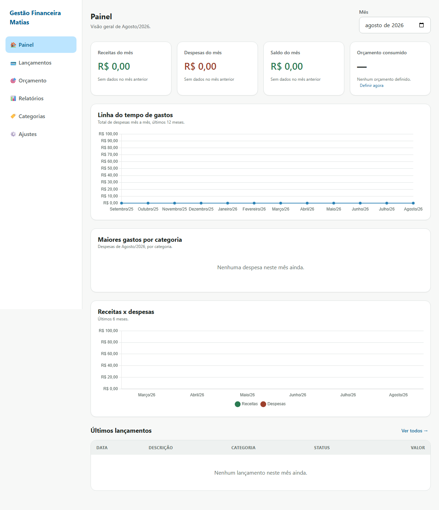
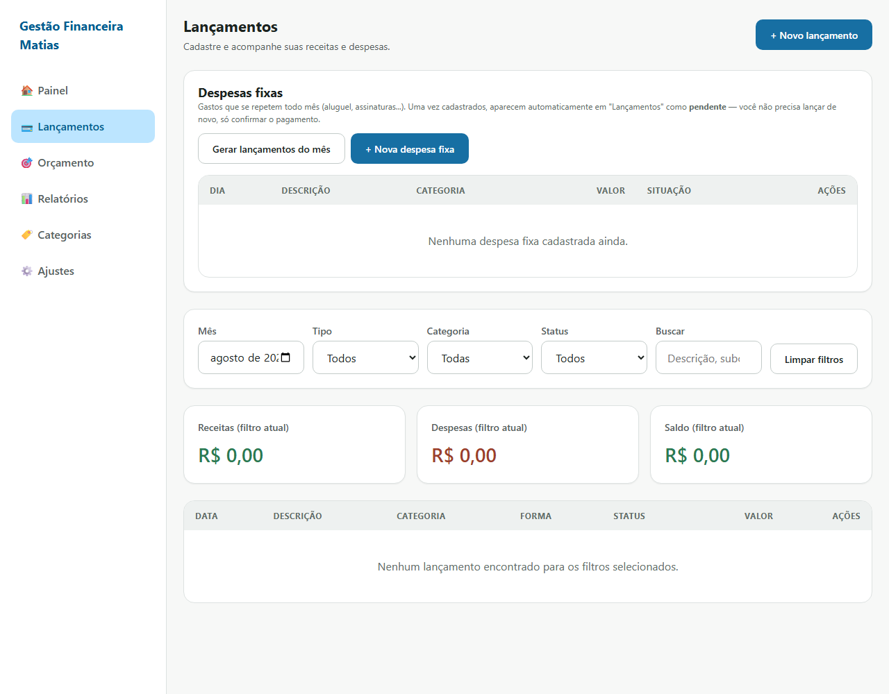
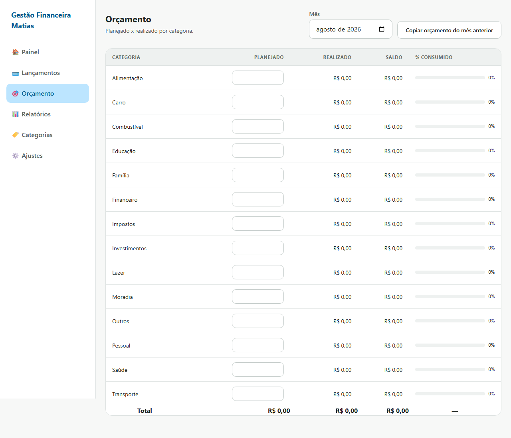
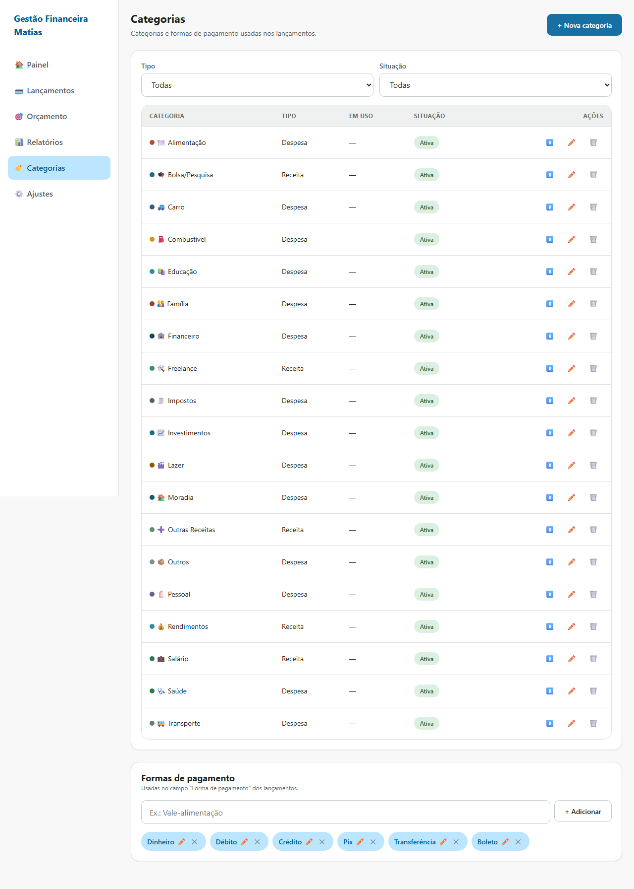
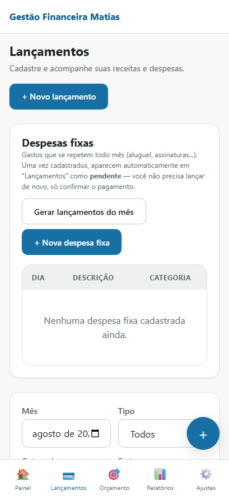

# Gestão Financeira Matias

Sistema web de gestão financeira pessoal — lançamentos, orçamento por
categoria e relatórios, pensado para uso diário no computador e no celular.

🔗 **Ao vivo:** [gestao-financeira-matias.vercel.app](https://gestao-financeira-matias.vercel.app)

> **Status:** Fase 4 concluída (PWA instalável/offline, acessibilidade,
> tratamento de erro de armazenamento). Publicado no Vercel com deploy
> automático a cada push na `main`.

## Telas

| Painel | Lançamentos |
|---|---|
|  |  |

| Orçamento | Categorias |
|---|---|
|  |  |

Mobile-first — navegação inferior fixa e formulário de lançamento pensado
para uso com uma mão só:



## Stack

- HTML5 + CSS3 puro + JavaScript ES6 (módulos nativos, sem build step)
- [Chart.js](https://www.chartjs.org/) via CDN (painel e relatórios)
- [SheetJS (xlsx)](https://sheetjs.com/) via CDN (planilha)
- Persistência: `localStorage`, com camada de acesso isolada em `assets/js/db.js`
- PWA instalável e offline (manifest + service worker com cache-first)
- Deploy: [Vercel](https://vercel.com/) (site estático, sem build), deploy
  automático a cada push na `main`

## Estrutura de pastas

```txt
├── index.html                 # dashboard (tela inicial)
├── lancamentos.html           # cadastro e listagem de lançamentos
├── orcamento.html             # orçamento mensal por categoria
├── relatorios.html            # gráficos e análises
├── categorias.html            # gerenciar categorias e formas de pagamento
├── configuracoes.html         # backup, importar/exportar, resetar dados
├── manifest.json
├── sw.js                      # service worker
├── vercel.json
├── assets/
│   ├── css/                   # reset, variáveis (design tokens), componentes, layout
│   ├── js/                    # app, db, modelos, cálculos, gráficos, importar/exportar, ui, formatadores, seed
│   ├── icons/                 # ícones do PWA
│   └── img/
├── dados/
│   └── categorias-padrao.json # categorias carregadas na primeira execução
└── docs/
    ├── ESTRUTURA-DADOS.md
    ├── COMO-USAR.md
    └── screenshots/
```

## Como rodar localmente

Não há build — basta servir os arquivos estáticos. Qualquer servidor HTTP
simples funciona (é necessário servir por HTTP, não abrir o `index.html`
direto do disco, por causa dos módulos ES e do `fetch` usado no seed):

```powershell
npx serve . -l 5173
```

Depois acesse `http://localhost:5173`.

## Modelo de dados

Ver [docs/ESTRUTURA-DADOS.md](./docs/ESTRUTURA-DADOS.md).

## Roteiro

- [x] **Fase 1** — estrutura, design system, base de dados e `lancamentos.html`
- [x] **Fase 2** — painel, orçamento, relatórios e despesas fixas recorrentes
- [x] **Fase 3** — categorias, importação/exportação de planilha e backup
- [x] **Fase 4** — PWA offline, acessibilidade e ajustes finais
- [x] **Fase 5** — publicação (GitHub + Vercel) — falta só você testar a
      instalação como PWA no seu celular
